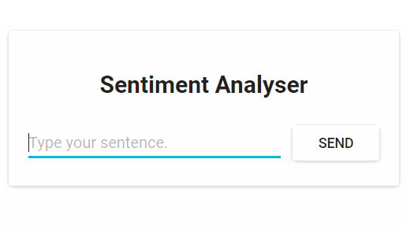
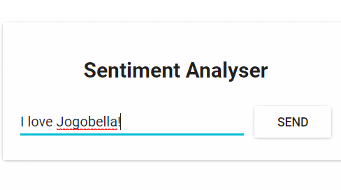
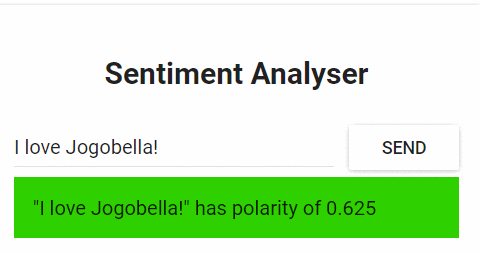

### Sentiment-Analysis-with-Kubernetes
#### Deploying a Microservice based application into a Kubernetes Managed Cluster.

The application has one functionality. It takes one sentence as input. 
Using Text Analysis, calculates the emotion of the sentence.

From the technical perspective, the application consists of three microservices. Each has one specific functionality:
SA-Frontend: a Nginx web server that serves our ReactJS static files.
SA-WebApp: a Java Web Application that handles requests from the frontend.
SA-Logic: a Python application that performs Sentiment Analysis.

We finally use Kubernetes for scalability by using load balancing between the various pods.

